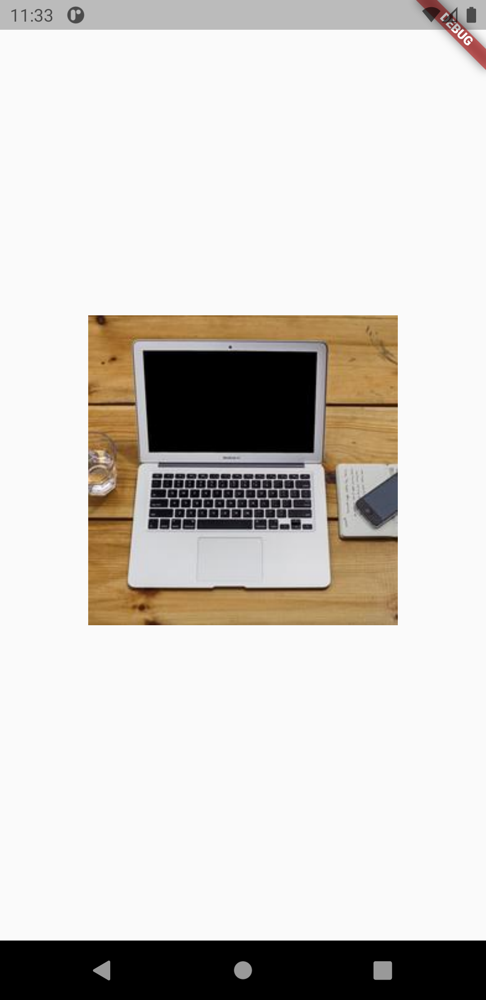

# animate_widget

It’s often helpful to guide users through an app as they navigate from screen to screen. A common technique to lead users through an app is to animate a widget from one screen to the next. This creates a visual anchor connecting the two screens.

<table>
  <tr>
    <td>Screen1</td>
     <td>Screen2</td>
  </tr>
  <tr>
    <td></td>
    <td></td>
 
  </tr>
 </table>